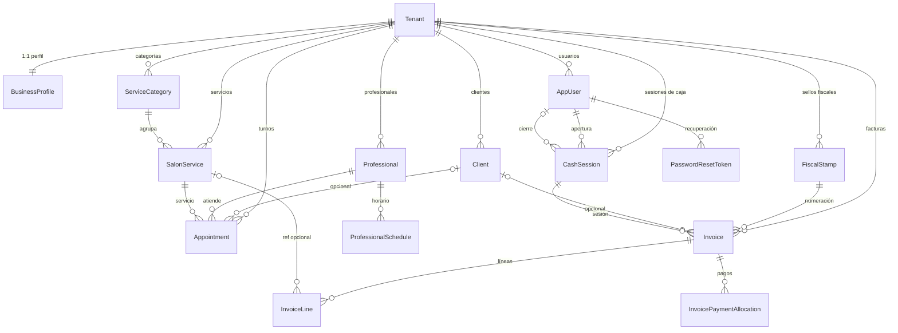

# Entidades de dominio

Este documento resume las **entidades JPA** en `src/backend/src/main/java/com/cursorpoc/backend/domain/`: nombres, significado en el dominio y relaciones. El producto es **multi-tenant**: la mayor parte de los datos están acotados por `Tenant`.

## Diagrama entidad-relación

## Tabla de entidades

| Entidad | Descripción |
| -------- | ----------- |
| **Tenant** | **Organización / salón** en el modelo multi-tenant; aísla los datos entre instalaciones del producto. |
| **BusinessProfile** | **Datos comerciales públicos** del tenant (razón o nombre comercial, RUC, dirección, contacto, logo); una fila por tenant (relación `1:1` con `Tenant`). |
| **AppUser** | **Usuario del back-office** que inicia sesión (email, hash de contraseña, rol); pertenece a un único tenant. |
| **PasswordResetToken** | **Token de un solo uso** con caducidad (almacenado como hash) para restablecer contraseña; referencia a `AppUser`. |
| **Client** | **Cliente final** del salón (nombre, teléfono, email, RUC opcional, activo, contador de visitas); acotado al tenant. |
| **Professional** | **Integrante del equipo** que presta servicios (nombre, contacto, foto, activo); acotado al tenant. |
| **ProfessionalSchedule** | **Franja horaria semanal** de disponibilidad de un profesional (día de la semana, hora inicio/fin en hora local); el tenant se deduce vía `Professional`. |
| **ServiceCategory** | **Rubro o agrupación** del catálogo de servicios (nombre, activo, acento de UI); acotada al tenant. |
| **SalonService** | **Servicio ofrecido** en el catálogo (nombre, precio, duración, categoría, activo); acotado al tenant. |
| **Appointment** | **Reserva / turno** con cliente opcional, profesional, servicio, intervalo de tiempo en instantes UTC, estado y motivo de cancelación si aplica. |
| **FiscalStamp** | **Configuración de timbrado / numeración fiscal** (vigencia, rango numérico, siguiente emisión, banderas de bloqueo); las facturas consumen la secuencia del sello. |
| **CashSession** | **Sesión de caja** (apertura y cierre, fondo inicial, arqueo); abierta y, si aplica, cerrada por un `AppUser`. |
| **Invoice** | **Comprobante de venta** con sello fiscal, número correlativo, cliente opcional o datos de facturación, importes, descuento, estado, momento de emisión y sesión de caja asociada. |
| **InvoiceLine** | **Renglón de factura** (descripción, cantidad, importes); puede referenciar un `SalonService`. |
| **InvoicePaymentAllocation** | **Desglose de cobro** de una factura por medio de pago (por ejemplo efectivo vs tarjeta) e importe. |
