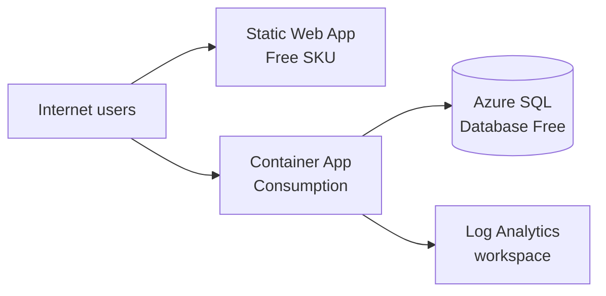

# Azure test environment (Terraform)

This folder contains Terraform under `terraform/` to provision a **small, cost-conscious test stack** on Azure:

- **Frontend**: [Azure Static Web Apps](https://learn.microsoft.com/en-us/azure/static-web-apps/overview) with the **Free** SKU. The default hostname is **public on the internet**. You still need to **publish your static build** (for example with the [Static Web Apps CLI](https://learn.microsoft.com/en-us/azure/static-web-apps/get-started-cli) or GitHub Actions) after Terraform finishes.
- **Backend**: [Azure Container Apps](https://learn.microsoft.com/en-us/azure/container-apps/overview) on the **Consumption** plan (serverless). Ingress is **external** so the app has a public FQDN. The template points at a **public** container image by default (no Azure Container Registry in this stack).
- **Database**: [Azure SQL Database](https://learn.microsoft.com/en-us/azure/azure-sql/database/free-offer?view=azuresql) with `**sku_name = "Free"`** in Terraform. **Do not set `max_size_gb`** on that database (explicit sizes often fail with `InvalidMaxSizeTierCombination`); omitting it lets Azure pick a valid default. This is **not** identical to the portal **“free offer”** (serverless + `useFreeLimit`), which needs different APIs or manual steps—see Microsoft’s docs for limits and quotas.

## High-level architecture




- The browser talks to **Static Web Apps** for the UI and to **Container Apps** for APIs.
- The backend reaches **Azure SQL** over the public endpoint. A firewall rule **“Allow Azure services”** (`0.0.0.0`–`0.0.0.0`) lets Azure-hosted workloads (including Container Apps) connect without listing changing outbound IPs.
- **Log Analytics** is required by the Container Apps environment for platform logging; it is **not** a “free unlimited” service (see warnings below).

## Free tier and billing warnings


| Area                     | Notes                                                                                                                                                                                                                                                                                                                                                                                         |
| ------------------------ | --------------------------------------------------------------------------------------------------------------------------------------------------------------------------------------------------------------------------------------------------------------------------------------------------------------------------------------------------------------------------------------------- |
| **Static Web Apps**      | **Free** SKU is used (`sku_tier` / `sku_size` = `Free`). Bandwidth and feature limits apply; see [pricing](https://azure.microsoft.com/pricing/details/app-service/static/).                                                                                                                                                                                                                  |
| **Container Apps**       | **Consumption** includes a **monthly free grant** (HTTP requests, vCPU-seconds, memory GiB-seconds). Usage **above** the grant is billed. See [billing](https://learn.microsoft.com/en-us/azure/container-apps/billing).                                                                                                                                                                      |
| **Log Analytics**        | Linked to the Container Apps environment. Ingestion and retention are typically **usage-based** after any account-level Azure Monitor free allowances. There is **no** blanket “always zero cost” guarantee for logs.                                                                                                                                                                         |
| **Azure SQL `Free` SKU** | Terraform uses `**sku_name = "Free"`** without `**max_size_gb**`. Microsoft’s **marketing free offer** (monthly vCore/storage caps, up to **10** databases) may require the portal or APIs with `**useFreeLimit`**—see the [FAQ](https://learn.microsoft.com/en-us/azure/azure-sql/database/free-offer-faq?view=azuresql). Some subscription types are **incompatible** with free SQL offers. |
| **Container registry**   | **Azure Container Registry has no free SKU** that matches a “always free” bar for private registries. This template **does not** deploy ACR. Use a **public** image (for example **GHCR** or **Docker Hub**) or add ACR knowing it is **paid**.                                                                                                                                               |


If your organization requires **every** component to be strictly zero cost with no usage-based billing, **stop**: Azure Container Apps (beyond free grant), Log Analytics, and any image registry you choose may incur charges. Adjust scale, logging, or services accordingly.

## Linking Terraform to the correct tenant and subscription

Terraform uses the Azure Resource Manager APIs. You must authenticate and target the right **Microsoft Entra tenant** and **Azure subscription**.

### 1. Azure CLI login (typical)

```bash
# Optional: pin a directory (tenant) if your account has several
az login --tenant "<TENANT_ID_OR_DOMAIN>"

az account set --subscription "<SUBSCRIPTION_ID_OR_NAME>"
az account show --output table
```

### 2. Subscription ID in Terraform

The `azurerm` **4.x** provider expects a **subscription ID**. This repo passes it via variable `subscription_id` in `terraform/terraform.tfvars` (see `terraform.tfvars.example`).

Alternatively, you can set the environment variable `**ARM_SUBSCRIPTION_ID`** to the same UUID and omit duplicating it in code, depending on how you prefer to run Terraform; the important part is that **plans and applies** hit the subscription you intend.

### 3. Service principal (CI/CD)

For pipelines, create an app registration / service principal with rights on the subscription (for example **Contributor** on the resource group or subscription), then configure:

- `ARM_CLIENT_ID`
- `ARM_CLIENT_SECRET`
- `ARM_TENANT_ID`
- `ARM_SUBSCRIPTION_ID`

Use OIDC federated credentials where possible instead of long-lived secrets.

### 4. Confirm providers and state

- From `infrastructure/terraform`, run `**terraform init -backend-config=backend.hcl`** (after `backend.hcl` exists; see §5). Plain `terraform init` is not enough if the backend block expects that file.
- **Remote state** uses an Azure Storage blob; the state key is `**cursor-poc.tfstate`** (see `versions.tf`). Bootstrap the storage once, then keep `backend.hcl` in sync (see below).

### 5. Remote state (Azure Storage) — one-time bootstrap

State is stored in a **blob** in an Azure Storage account (with locking). The app stack Terraform does **not** create this storage; create it manually or with a small script so state stays independent of the resources it manages.

**Automated bootstrap (recommended):** from the repo root, after `az login` (and optionally `az account set`):

```bash
./scripts/bootstrap-terraform-remote-state.sh
```

This creates the resource group, storage account, and `tfstate` container; writes `infrastructure/terraform/backend.hcl`; and runs `terraform init -backend-config=backend.hcl` if Terraform is installed. Use `./scripts/bootstrap-terraform-remote-state.sh --help` for options (custom subscription, storage name, `--migrate-state` for existing local state, `--no-init` to skip Terraform).

**Manual steps** (equivalent to the script):

1. **Pick names** (storage account names must be **globally unique**, 3–24 characters, lowercase letters and numbers only):
  - Resource group for state only, e.g. `rg-terraform-state`
  - Storage account, e.g. `sttfstate<shortunique>`
  - Container name, e.g. `tfstate`
2. **Create the resources** (after `az login` and `az account set` to your subscription):
  ```bash
   LOCATION="eastus2"
   RG_NAME="rg-terraform-state"
   STORAGE_NAME="sttfstateYOURUNIQUE"   # change YOURUNIQUE — must be globally unique

   az group create --name "$RG_NAME" --location "$LOCATION"

   az storage account create \
     --name "$STORAGE_NAME" \
     --resource-group "$RG_NAME" \
     --location "$LOCATION" \
     --sku Standard_LRS \
     --encryption-services blob

   az storage container create \
     --name tfstate \
     --account-name "$STORAGE_NAME" \
     --auth-mode login
  ```
3. **Configure the backend**: from `infrastructure/terraform`, copy the example and edit:
  ```bash
   cp backend.hcl.example backend.hcl
   # Edit backend.hcl: resource_group_name, storage_account_name, container_name
  ```
4. **Initialize Terraform** (first time with remote backend):
  ```bash
   terraform init -backend-config=backend.hcl
  ```
   If you **already have a local** `terraform.tfstate` from an earlier apply, **migrate** it to the blob:
   Terraform will prompt to copy the existing state into Azure Storage.
5. **CI/CD**: the same storage account and `backend.hcl` values apply; the pipeline identity needs permission to read/write blobs on that account (for example **Storage Blob Data Contributor** on the storage account or container if using Azure AD auth, or use a service principal that can manage the account per Terraform’s [azurerm backend](https://developer.hashicorp.com/terraform/language/settings/backends/azurerm) documentation).

### Common `terraform apply` errors


| Symptom                                                                       | What to do                                                                                                                                                                                                                                                                                                                                                                                   |
| ----------------------------------------------------------------------------- | -------------------------------------------------------------------------------------------------------------------------------------------------------------------------------------------------------------------------------------------------------------------------------------------------------------------------------------------------------------------------------------------- |
| `**MissingSubscriptionRegistration`** for `**Microsoft.App**`                 | The subscription must allow the Container Apps resource provider. This repo registers `**Microsoft.App**` in Terraform (`azurerm_resource_provider_registration`) before creating the Container Apps environment. If registration is slow, wait and re-apply, or run `az provider register --namespace Microsoft.App --wait` once.                                                           |
| `**LocationNotAvailableForResourceType**` for `**Microsoft.Web/staticSites**` | **Static Web Apps (Free)** is not offered in every region (for example `**eastus`** is often unavailable). Use a supported region such as `**eastus2**`, `**centralus**`, `**westus2**`, or `**westeurope**` (see the error’s list). The default `location` in this repo is `**eastus2**`.                                                                                                   |
| `**ProvisioningDisabled**` for Azure SQL in a region                          | Some subscriptions cannot create SQL servers in certain regions (including **eastus2**). Set `**sql_server_location`** in `terraform.tfvars` to a region where SQL provisions (often `**westeurope**` or `**centralus**`). The app stack stays in `**location**`; only the SQL server is created in `**sql_server_location**` (public endpoint + firewall rule still allows Azure services). |
| **Partial apply, then you change `location`**                                 | The resource group’s region cannot be updated in place. Run `**terraform destroy**` (or delete the stack in the portal), set `location` to a working region, and apply again.                                                                                                                                                                                                                |
| `**InvalidMaxSizeTierCombination**` for `**azurerm_mssql_database**`          | The `**Free**` SKU rejects many explicit `**max_size_gb**` values. This template **omits `max_size_gb`** so Azure sets a valid default. Do not add `**max_size_gb**` unless you change SKU (for example **Basic** with a supported size).                                                                                                                                                    |


## After `terraform apply`

1. **Frontend**: Deploy the Vite build to Static Web Apps. Set `VITE_API_BASE_URL` at **build time** to the backend URL from output `container_app_fqdn` (HTTPS, no trailing slash), matching `src/frontend/src/api/baseUrl.ts`.
2. **Backend**: Replace `backend_container_image` with your real Spring Boot image. The app uses **SQL Server** locally and in Azure; ensure the image includes the JDBC driver and Flyway migrations for SQL Server (aligned with `application.properties`).
3. **Secrets**: Outputs include a generated SQL password (`sql_admin_password`). Treat outputs as sensitive; rotate credentials for anything long-lived.

## File layout


| Path                                          | Purpose                                                                                                           |
| --------------------------------------------- | ----------------------------------------------------------------------------------------------------------------- |
| `terraform/versions.tf`                       | Terraform and provider versions                                                                                   |
| `terraform/providers.tf`                      | `azurerm` provider (subscription)                                                                                 |
| `terraform/variables.tf`                      | Input variables                                                                                                   |
| `terraform/main.tf`                           | Core resources                                                                                                    |
| `terraform/outputs.tf`                        | Hostnames, JDBC URL, `sql_server_location`, sensitive deployment key                                              |
| `terraform/terraform.tfvars`                  | Subscription and variables (tracked in this repo; adjust for your subscription)                                   |
| `terraform/terraform.tfvars.example`          | Example variable file                                                                                             |
| `terraform/backend.hcl.example`               | Example remote-state backend config (copy to `backend.hcl`, or use `scripts/bootstrap-terraform-remote-state.sh`) |
| `scripts/bootstrap-terraform-remote-state.sh` | Creates state storage in Azure, writes `backend.hcl`, runs `terraform init`                                       |
| `terraform/.gitignore`                        | Ignores state and `*.tfvars` except `terraform.tfvars.example` and `**terraform.tfvars`** (both can be tracked)   |


